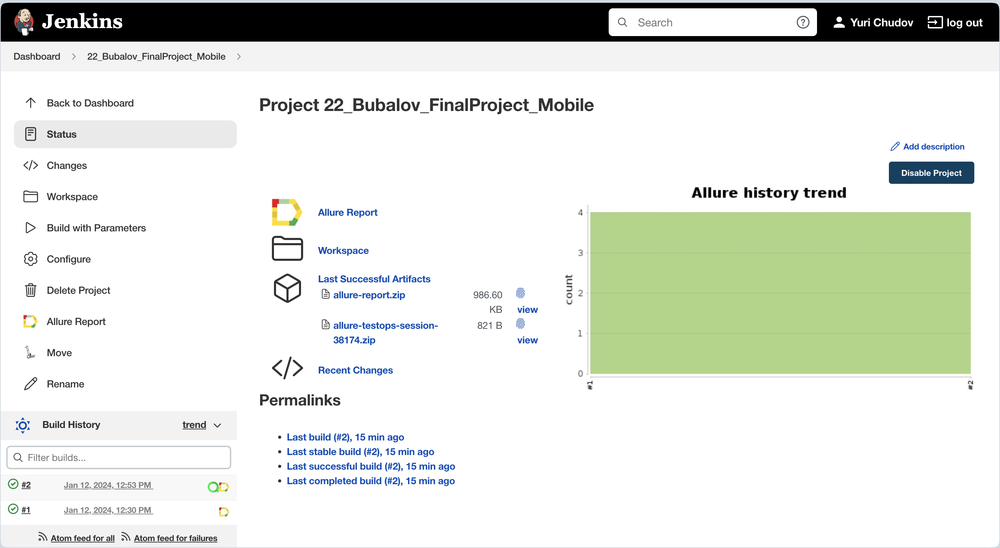
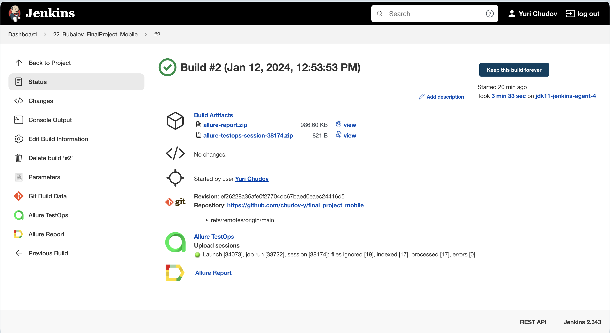
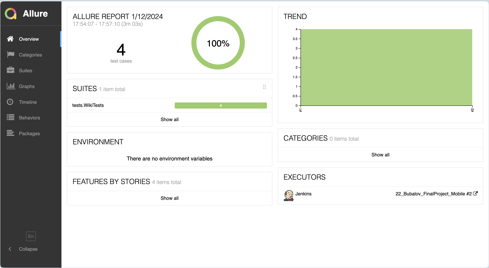
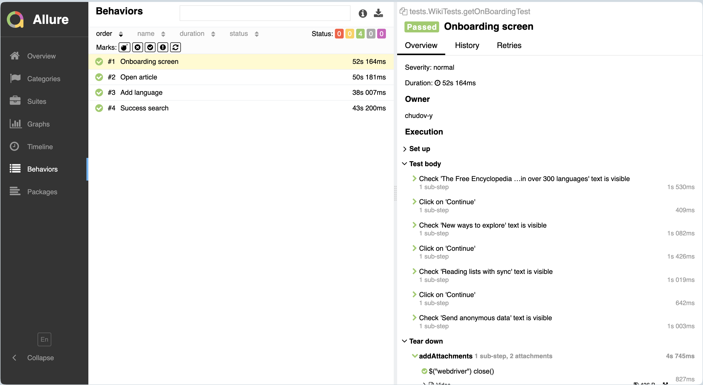
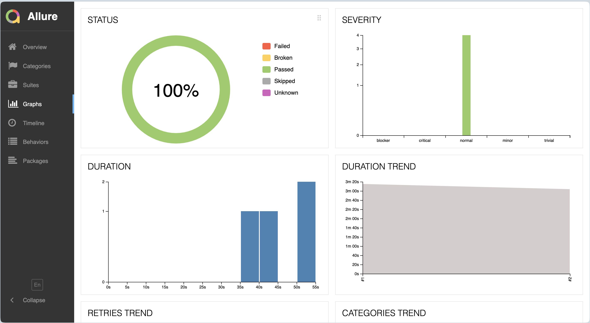
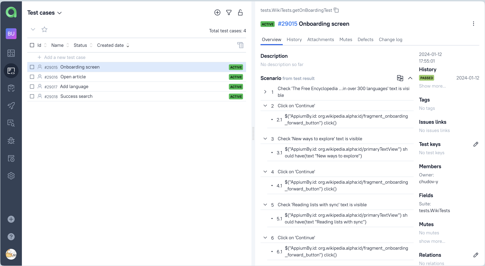
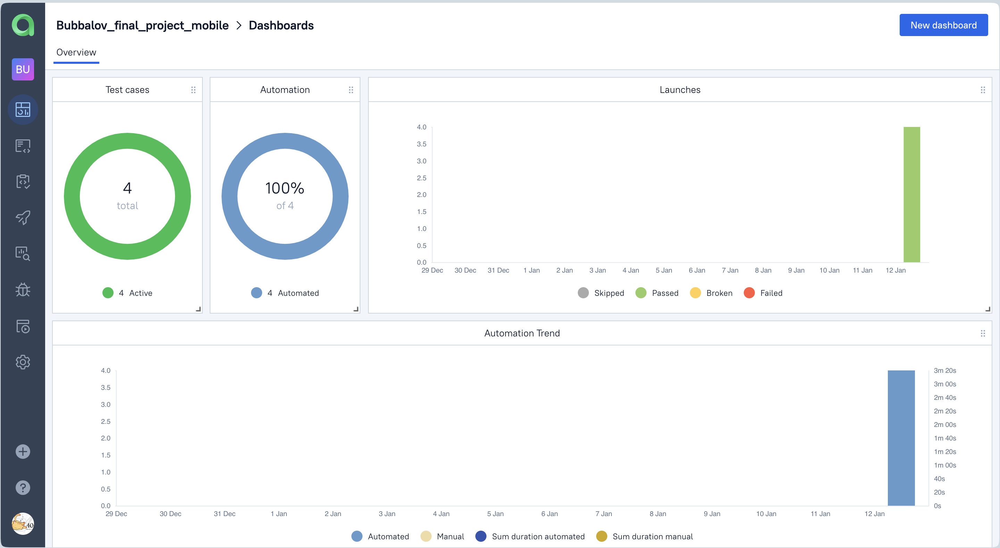
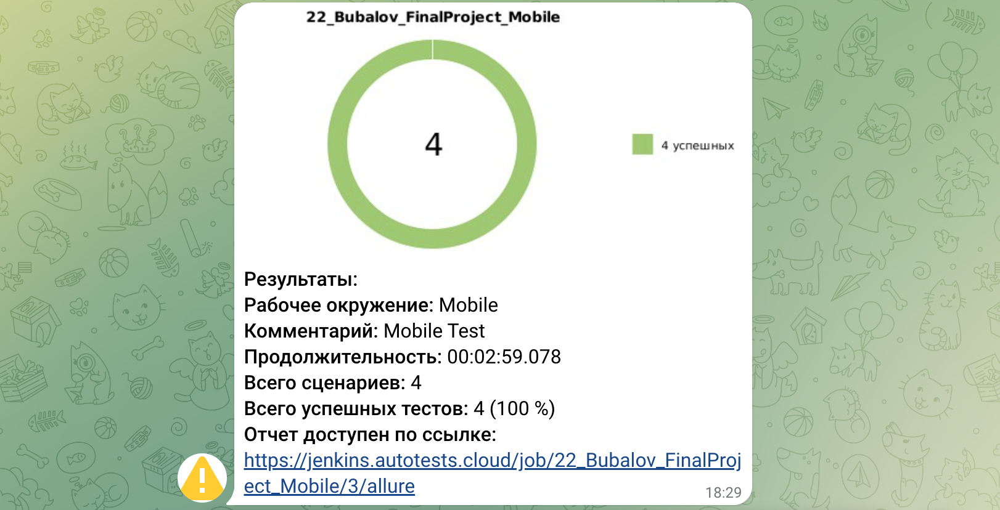
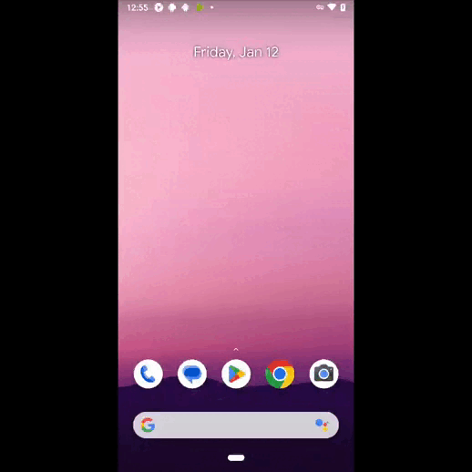

# Проект по автоматизации тестирования мобильного приложения Wikipedia

<p align="center">
  
</p>

##	Содержание

- [Технологии и инструменты](#технологии-и-инструменты)
- [Реализованныe проверки](#реализованные-проверки)
- [Запуск тестов из терминала](#запуск-тестов-из-терминала)
- [Запуск тестов в Jenkins](#запуск-тестов-в-jenkins)
- [Отчет о результатах тестирования в Allure Report](#отчет-о-результатах-тестирования-в-Allure-report)
- [Интеграция с Allure TestOps](#интеграция-с-allure-testops)
- [Интеграция с Jira](#интеграция-с-jira)
- [Уведомления в Telegram с использованием бота](#уведомления-в-telegram-с-использованием-бота)
- [Пример запуска теста в Selenoid](#пример-запуска-теста-в-selenoid)

## Технологии и инструменты

<p  align="center">


</p>

## Реализованные проверки

- [x] *Поиск статьи*
- [x] *Открытие статьи*
- [x] *Проверка 4-х страниц на getting started (onBoarding screen)*
- [x] *Добавление языка*

## Запуск тестов из терминала

### Локальный запуск тестов

```bash
gradle clean test -DdeviceHost=local
```

### Удаленный запуск тестов

```bash
gradle clean test -DdeviceHost=browserstack
```

## Запуск тестов в [Jenkins](https://jenkins.autotests.cloud/job/22_Bubalov_FinalProject_Mobile/)

#### Главная страница Jenkins

<p align="center">
  
</p>

Для запуска сборки необходимо нажать кнопку <code><strong>*Build with Parameters*</strong></code>.

#### Значок Allure Report

<p align="center">
  
</p>

Результаты сборки можно посмотреть в Allure отчёте, кликнув на значок <code><strong>*Allure Report*</strong></code>.

## Отчет о результатах тестирования в [Allure Report](https://jenkins.autotests.cloud/job/22_Bubalov_FinalProject_Mobile/allure/)

#### Главная страница Allure Report

<p align="center">
  
</p>

#### Тесты

<p align="center">
  
</p>

#### Графики

<p align="center">
  
</p>

## Интеграция с [Allure TestOps](https://allure.autotests.cloud/project/3964/dashboards)

#### Тест-кейсы

<p align="center">
  
</p>

#### Дашборды

<p align="center">
  
</p>

## Уведомления в Telegram с использованием бота

#### Оповещение о результатах сборки

<p align="center">
  
</p>

## Пример запуска теста

К каждому тесту в отчете прилагается видео.

На данном видео выполняется:

- Проверка открытия статьи

<p align="center">
  
</p>